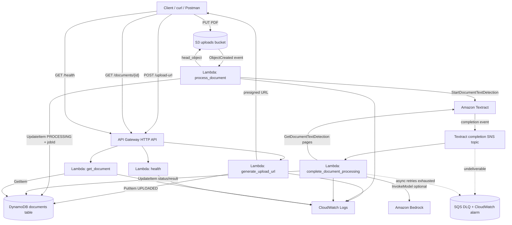
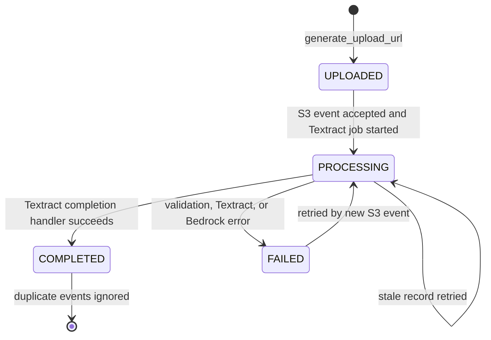

# Architecture

```mermaid
flowchart TD
    Client[Client / curl / Postman]
    APIGW[API Gateway HTTP API]
    GenURL[Lambda: generate_upload_url]
    GetDoc[Lambda: get_document]
    Health[Lambda: health]
    S3[(S3 uploads bucket)]
    ProcDoc[Lambda: process_document]
    CompleteDoc[Lambda: complete_document_processing]
    Textract[Amazon Textract]
    SNS[Textract completion SNS topic]
    DLQ[(SQS DLQ + CloudWatch alarm)]
    Bedrock[Amazon Bedrock]
    DDB[(DynamoDB documents table)]
    CW[CloudWatch Logs]

    Client -- POST /upload-url --> APIGW
    Client -- GET /documents/{id} --> APIGW
    Client -- GET /health --> APIGW

    APIGW --> GenURL
    APIGW --> GetDoc
    APIGW --> Health

    GenURL -->|PutItem UPLOADED| DDB
    GenURL -->|presigned URL| Client
    Client -- PUT PDF --> S3

    S3 -- ObjectCreated event --> ProcDoc
    ProcDoc -->|head_object| S3
    ProcDoc -->|StartDocumentTextDetection| Textract
    ProcDoc -->|UpdateItem PROCESSING + jobId| DDB
    Textract -->|completion event| SNS
    SNS --> CompleteDoc
    SNS -.->|undeliverable| DLQ
    CompleteDoc -.->|async retries exhausted| DLQ
    CompleteDoc -->|GetDocumentTextDetection pages| Textract
    CompleteDoc -->|InvokeModel optional| Bedrock
    CompleteDoc -->|UpdateItem status/result| DDB

    GetDoc -->|GetItem| DDB

    GenURL --> CW
    ProcDoc --> CW
    CompleteDoc --> CW
    GetDoc --> CW
    Health --> CW
```

## Status flow

```mermaid
stateDiagram-v2
    [*] --> UPLOADED: generate_upload_url
    UPLOADED --> PROCESSING: S3 event accepted and Textract job started
    PROCESSING --> COMPLETED: Textract completion handler succeeds
    PROCESSING --> FAILED: validation, Textract, or Bedrock error
    PROCESSING --> PROCESSING: stale record retried
    FAILED --> PROCESSING: retried by new S3 event
    COMPLETED --> [*]: duplicate events ignored
```
